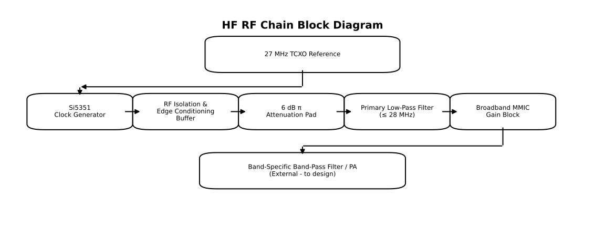

# HF RF Chain Architecture and Gain Plan

## Overview

This document describes the **end-to-end HF RF signal chain**, design intent, and gain planning
for the WsprryPi µHAT RF subsystem. It ties together the individual functional blocks documented
elsewhere and explains how they interact to produce a clean, predictable HF output.

This README covers the signal generation through initial amplification. It does not address PA
or additional filters for transmission.

The architecture is optimized for:

- Spectral cleanliness over absolute power
- Predictable, fixed gain behavior
- Simple application without tuning or adjustment
- Robustness across all HF bands (160 m through 10 m)

---

## System-Level Design Philosophy

The RF chain follows a deliberate philosophy:

- Treat the Si5351 as a **digital waveform source**, not an RF generator
- Remove spectral artifacts **before amplification**
- Use fixed attenuation and gain rather than variable stages
- Operate all active devices **well below compression**
- Prefer repeatability and margin over maximum output power

This approach produces a transmitter that is easy to reproduce, stable across bands,
and well-behaved in terms of spectral emissions.

---

## High-Level Signal Flow

The RF signal path is shown below, in logical order:

Each block has a clearly defined role and does not overlap responsibility with adjacent stages.

---

## Functional Block Roles

### 27 MHz TCXO Reference

Provides the master frequency reference for the system.

- Sets absolute frequency accuracy
- Influences close-in phase noise
- Isolated from digital noise via local supply filtering

Documented in: [**27 MHz TCXO Reference Circuit**](./27%20MHz%20TCXO%20Block/README.md)

---

### Si5351 Clock Generator

Generates the programmable digital square-wave frequency using the external TCXO reference.

- Produces a deterministic CMOS clock waveform
- Output drive is configured once and left fixed
- Raw output is not considered spectrally clean

Documented in: [**Si5351 Clock Generator Circuit**](./Si5351%20Clock%20Generator%20Circuit/README.md)

---

### RF Isolation & Edge Conditioning Buffer

Provides electrical isolation between the Si5351 and the analog RF chain.

- Reduces load sensitivity at the Si5351 output
- Lowers effective source impedance
- Suppresses fast-edge spectral components
- Provides a repeatable drive into the attenuation pad

This stage provides approximately unity voltage gain while supplying current gain, impedance isolation, and edge conditioning.

Documented in: [**RF Isolation & Edge Conditioning Buffer**](./RF%20Conditioning%20Buffer/README.md)

---

### 6 dB π Attenuation Pad

Establishes a fixed signal level and system impedance early in the chain.

- Enforces 50 ohm source and load impedance
- Reduces broadband edge energy
- Improves filter and MMIC behavior
- Simplifies gain planning

The pad is permanently installed and not adjusted at runtime.

Documented in: [**6 dB π Attenuation Pad**](./6dB%20Pi%20Pad/README.md)

---

### Primary Low-Pass Filter

Defines the upper spectral boundary of the HF system.

- Cutoff just above 28 MHz
- Minimal passband loss
- Strong suppression of harmonics
- Prevents MMIC stages from amplifying out-of-band energy

This is the primary harmonic control stage.

Documented in: [**Primary Low-Pass Filter (≤ 28 MHz)**](./Primary%20LPF%20Block/README.md)

---

### Broadband MMIC Gain Block

Restores signal level after attenuation and filtering.

- Provides fixed, frequency-dependent gain
- Operated with significant linearity margin
- No bias tuning or adjustment required

This stage is intentionally not pushed to maximum output power.

Documented in: [**Broadband MMIC Gain-Block Driver**](./Broadband%20MMIC%20Gain%20Block/README.md)

---

## Gain and Level Planning

The RF chain uses **fixed gain and attenuation** throughout. There are no variable RF gain controls.

A typical level progression is:

- Si5351 output: logic-level clock waveform
- After buffer: same amplitude, improved source characteristics
- After 6 dB pad: reduced and controlled level
- After LPF: slightly reduced, spectrally clean signal
- After MMIC: restored to a usable RF drive level

Exact absolute power depends on frequency and MMIC variant,
but all stages are operated below compression.

---

## Compression and Linearity Strategy

No stage in the RF chain is intended to operate near compression.

- The buffer operates in its linear region
- The attenuation pad provides headroom margin
- The MMIC is driven conservatively

This prevents:

- Harmonic regrowth
- IMD products
- Band-dependent distortion

Downstream band-pass filters and power stages see a clean, predictable input.

---

## Assumptions and Constraints

- All RF interfaces are nominally **50 ohms**
- Supply rails are stable and locally decoupled
- Output power is secondary to spectral performance
- Band-specific filtering or PA stages follow this chain

The RF chain is intentionally conservative and not optimized for maximum output power.

---

## Extensibility

The architecture supports:

- Substitution of different MMIC variants
- Additional fixed attenuation if required
- Alternative band-pass or PA implementations

Because gain is fixed and margins are maintained,
changes do not require re-tuning the entire chain.

---

## Summary

This HF RF chain architecture provides a disciplined, repeatable approach to HF signal generation.
By separating responsibilities across fixed-function blocks and prioritizing spectral cleanliness,
the design achieves reliable performance across all HF bands without tuning or adjustment.

Each block is simple, well-defined, and documented independently, while this document
captures the system-level intent and gain plan.
